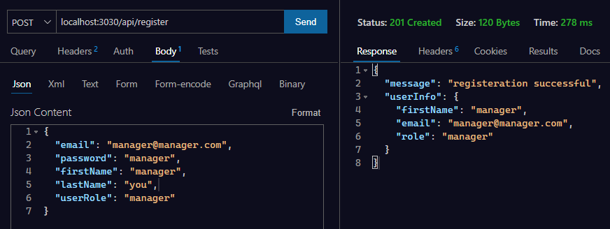
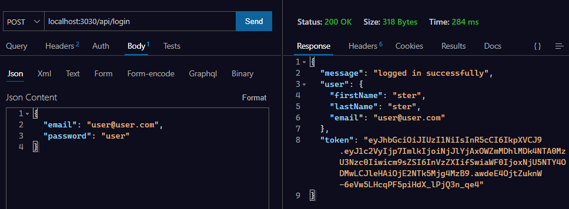
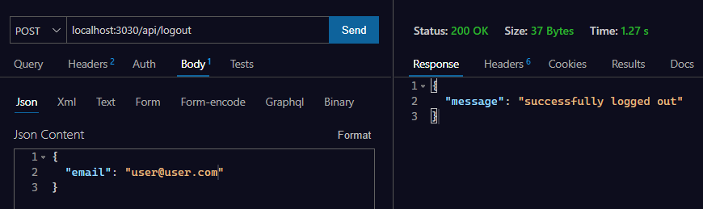
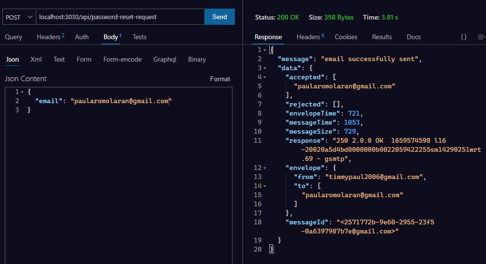
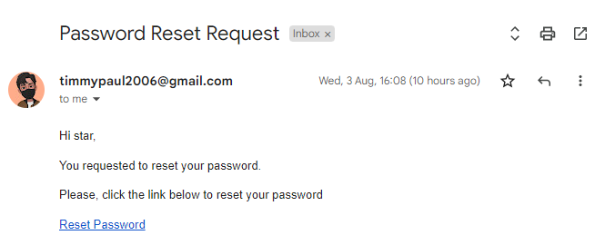
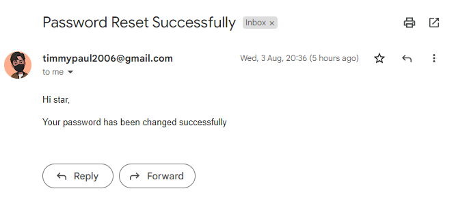
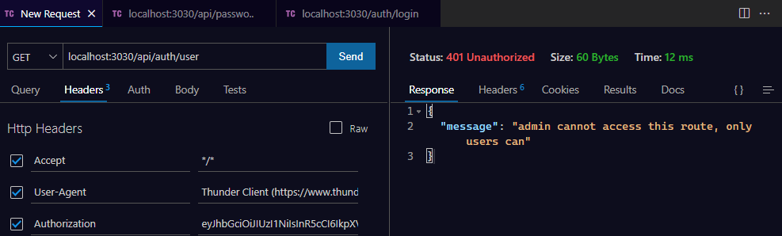
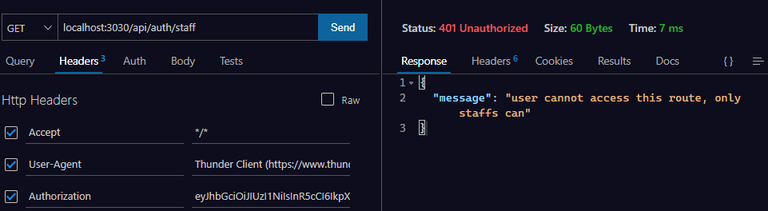
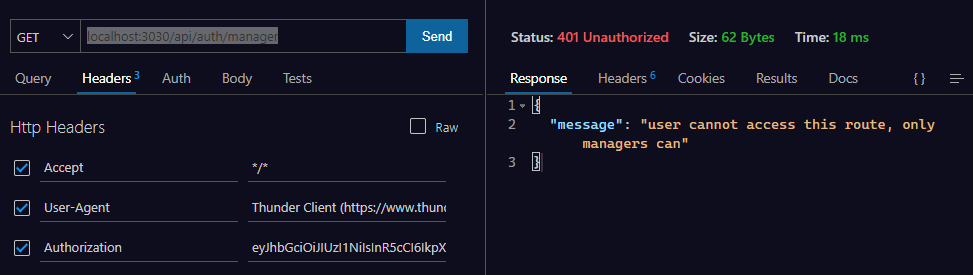
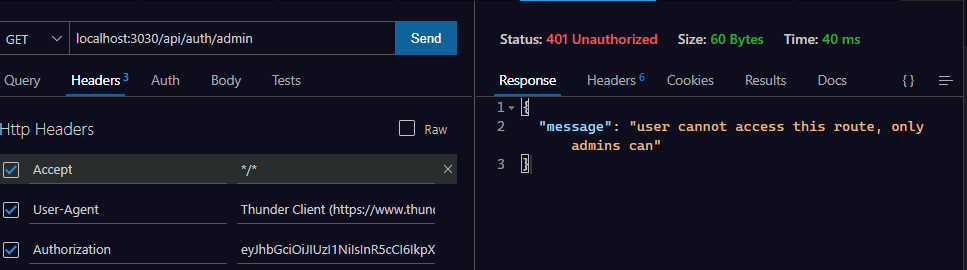

## Authentication System 🔐

- built with ExpressJs , JWTs and NodeJs

### API Routes

- Register (`/api/register`)
  

---

- Login (`/api/login`)
  

---

- Logout (`/api/logout`)
  

---

- Password Reset Request (`/api/password-reset-request`)
  
  

---

- Password Reset (`/api/passwordReset`)
  

---

- Get Users (`/api/auth/user`)
  

- Get Staffs (`/api/staff`)
  

- Get Managers (`/api/manager`)
  

- Get Admin (`/api/admin`)
  

## Continued Development

- [ ] Properly modularize code (more utils and middlewares)
- [ ] Implement more robust error handling

### Useful Resources

[Implementing a secure password reset in Node.js](https://blog.logrocket.com/implementing-a-secure-password-reset-in-node-js/)
